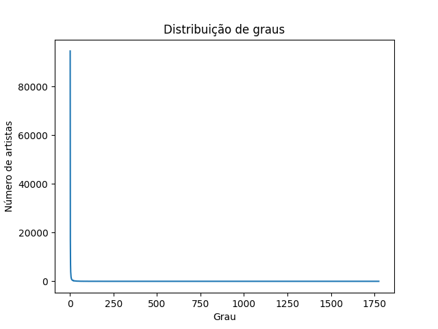
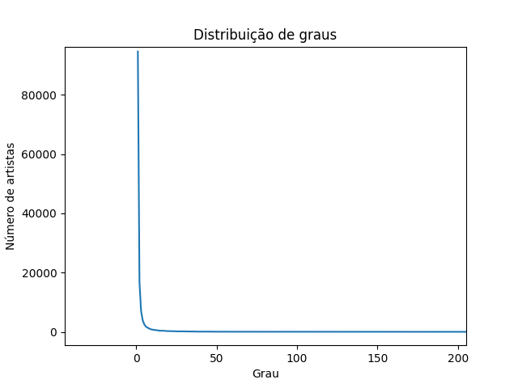
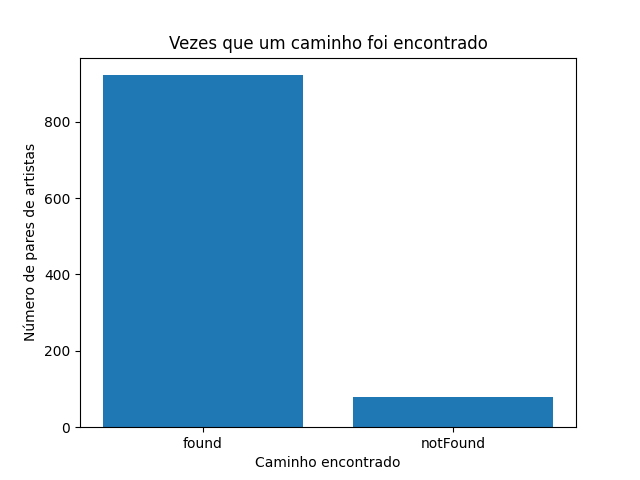
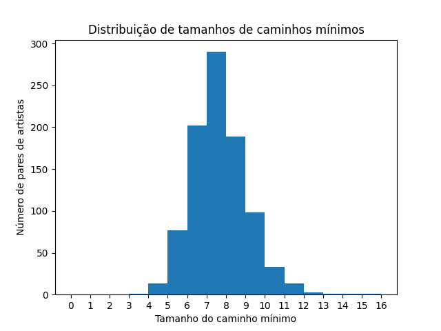
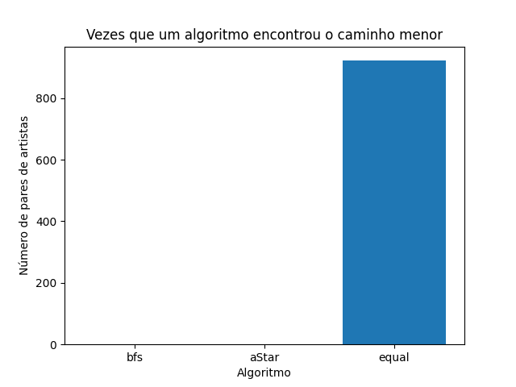
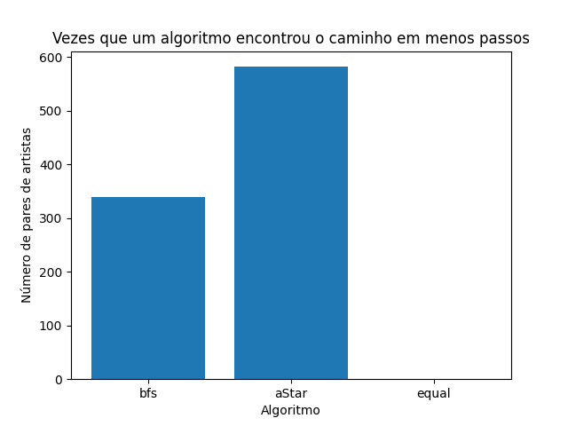
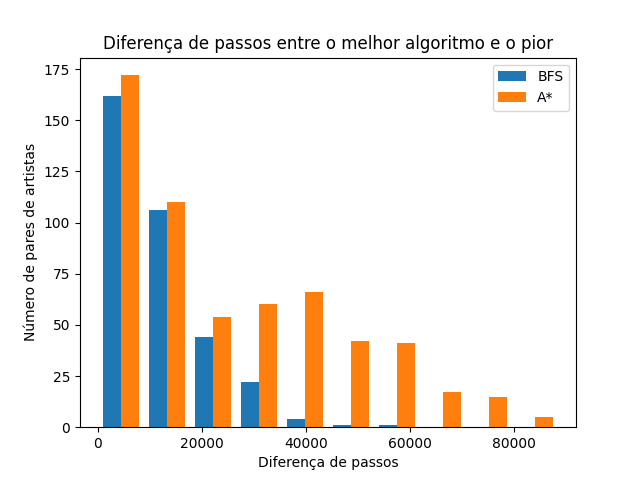

# ArtistsCollabDistance

This is a project for the discipline of Artificial Intelligence - SCC0230 at ICMC - USP.

The goal of this project is to compare a uninformed search algorithm (BFS) with an informed search algorithm (A\*) in a problem of finding a path between two artists in a graph of artists being the nodes and their collaborations being the edges.

The dataset used in this project consists of two CSV files, one containig ~156k artists and other containing 300k+ collaborations between them. The data was collected from Spotify and was obtained from [this Kaggle dataset](https://www.kaggle.com/datasets/jfreyberg/spotify-artist-feature-collaboration-network).

## Heuristics Choice

This project used an experimental heuristic. The heuristic is based on the popularity rating given by Spotify summed with the percentage of the target artist's genres that are present in the current artist's genres. The popularity rating is a value between 0 and 1 and the percentage of genres is a value between 0 and 1.The greater the value of the heuristic, the closer the current artist is to the target artist. The heuristic is calculated as follows:

```python
def artistProximityHeuristic(src, targetGenreMap):
    sameGenres = 0
    for genre in src['genres']:
        if genre in targetGenreMap:
            sameGenres += 1
    sameGenres = 0 if len(
        targetGenreMap) == 0 else sameGenres / len(targetGenreMap)
    return sameGenres + src['popularity']
```

## Students:

- Eduardo Rodrigues Amaral - 11735021
- Gabriela Rodrigues do Prado - 11892917
- Laís Saloum Deghaide - 11369767
- Otto Cruz Fernandes - 11275130

## Specifications:

- Python 3.10.7

## Instructions:

- Dependency installation:

  Before running the project, you need to install the dependencies. To do so, run the following command in the project's root directory:

  ```
  pip install -r requirements.txt
  ```

- To run a search between two artists, run the following command:

  ```
  python3 main.py
  ```

  Enter the name of the first artist and then the name of the second artist, then enter the algorithm you want to use (bfs or aStar).

  The program will output the path between the two artists and the number of nodes visited.

- To analyze the degrees of each artist, run the following command:

  ```
  python3 main.py analyze degree
  ```

- To run x experiments with random artists, run the following command:

  ```
  python3 main.py analyze efficiency <number of experiments>
  ```

  The results will be saved in `experiments/dd-mm-yy hh-mm-ss.json`

- To plot information from the experiments, run the following command:
  ```
  python3 main.py plot efficiency <path to the json file>
  ```
- To plot the graph in a interactive way, run the following command:
  ```
    python3 main.py plot graph <number of nodes to include>
  ```

## Degree Analysis:

Degree of artists nodes distribution:





## Efficiency Analysis:

An experiment was run with 1000 random artists pairs, the results are shown below:

### Number of paths found:

- A path was found 922 times.

- A path was not found 78 times.

- 

### Path Length:

- Average Path Length:
  7.18
- Path's Length Histogram:

  

### Number of times each algorithm found a path:



### Number of times each algorithm found a path in less steps than the other:

- BFS:
  36.88%

- A\*:
  63.12%
- 

### Distribution of steps difference between the faster algorithm and the slower algorithm (when BFS was faster and when A\* was faster):

- When BFS was faster the average difference was 11178 steps

- When A\* was faster the average difference was 25436 steps

- 

## Graph Plot:

Graph Network Plot using a 5 thousand node sample (doesn't represent the full network much).

https://user-images.githubusercontent.com/33560560/197028568-bb383eda-7775-4a89-9d39-cf0b9d2f3b0f.mp4
